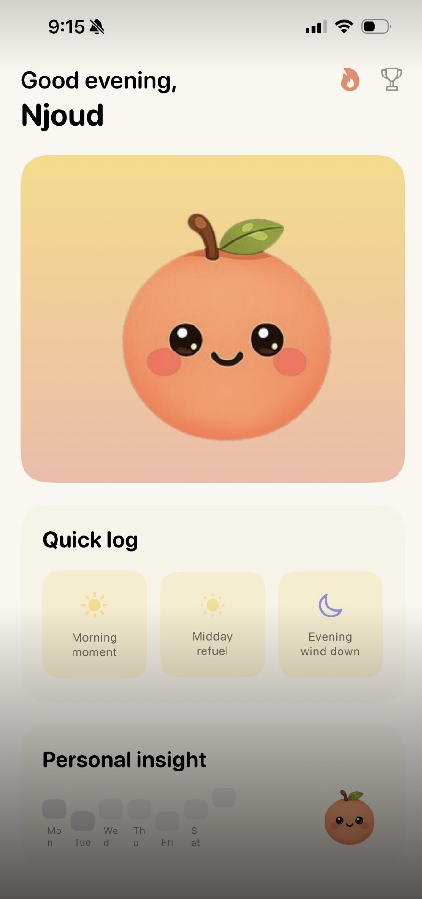
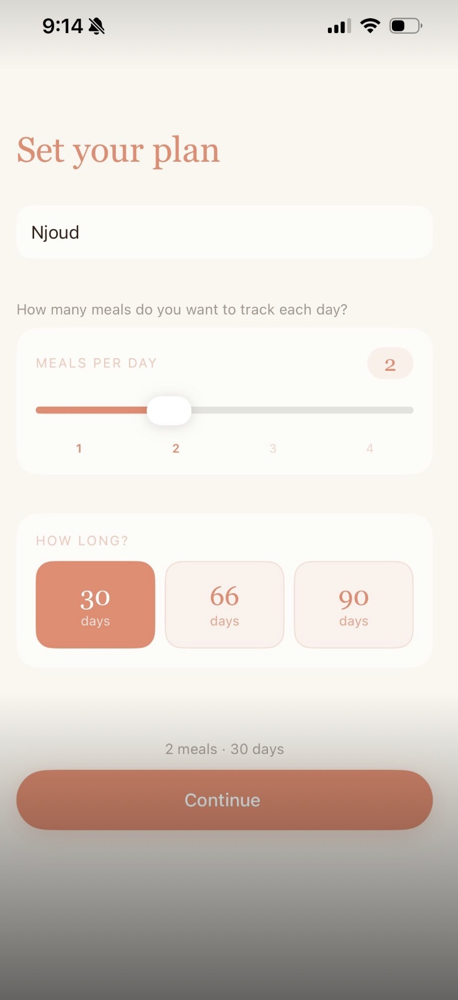
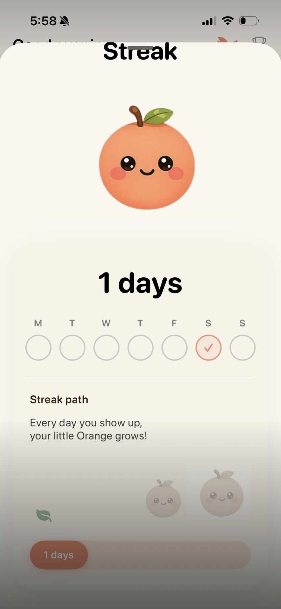
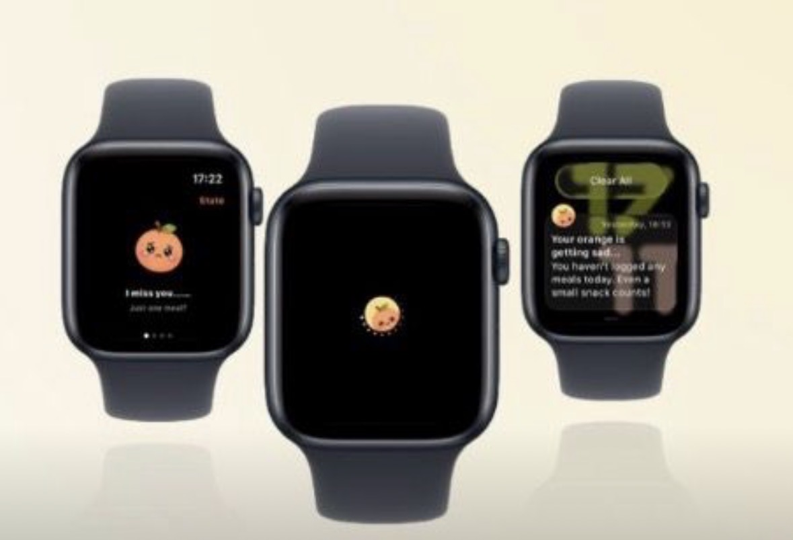

# MyMealo 🍊

  

## About MyMealo

**MyMealo** is an iOS and watchOS application designed to help users build more consistent meal habits through reminders, progress tracking, and simple daily insights.

## My Role

**iOS Developer**

I contributed to the development of MyMealo as part of a collaborative team, with a focus on implementing app functionality and supporting the integration between the iPhone and Apple Watch experience.

## Key Features

- Personalized meal tracking
- Daily meal reminders
- Streak tracking
- Progress insights
- Apple Watch support
- Friendly and engaging user experience

## Technologies

- Swift
- SwiftUI
- Xcode
- watchOS
- TestFlight
- Figma

## App Preview

  
  

## Apple Watch Experience

  

